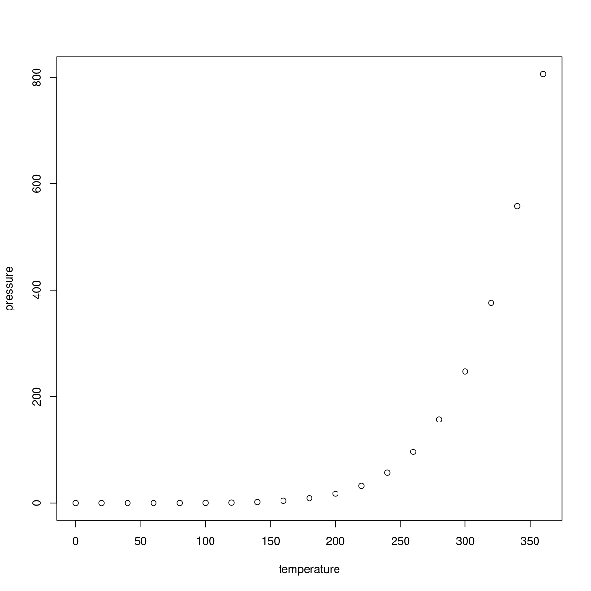

---
# Please do not edit this file directly; it is auto generated.
# Instead, please edit 01TextminingwithREpisode1.md in _episodes_rmd/
title: "Episode 1 Loading data"
teaching: 0
exercises: 0
questions:
- "What is a model?"
objectives:
- "First learning objective. (FIXME)"
keypoints:
- "First key point. Brief Answer to questions. (FIXME)"
---

## R Markdown
## What is text mining?
Text mining refers to the use of digital tools to enable automatized analyses of text data. These analyses can enable insight into a collection of texts that can be
difficult to spot with the naked eye. Furthermore, text mining tools allow the user to analyze large samples of texts and visualize the results

## Installing and loading relevant libraries
We need to install some libraries that can perform the various steps in text analysis, because the base functions of R are not enough. Then we need to load them

Documentation for each package:  
*https://www.tidyverse.org/packages/  
*https://cran.r-project.org/web/packages/tidytext/vignettes/tidytext.html  
*https://cran.r-project.org/web/packages/tm/tm.pdf  

~~~
install.packages("tidyverse")
~~~
{: .language-r}

~~~
Installing package into '/home/runner/work/_temp/Library'
(as 'lib' is unspecified)
~~~
{: .output}

~~~
install.packages("tidytext")
~~~
{: .language-r}

~~~
Installing package into '/home/runner/work/_temp/Library'
(as 'lib' is unspecified)
~~~
{: .output}

~~~
install.packages("tm")
~~~
{: .language-r}

~~~
Installing package into '/home/runner/work/_temp/Library'
(as 'lib' is unspecified)
~~~
{: .output}

~~~
library(tidyverse)
~~~
{: .language-r}

~~~
── Attaching packages
───────────────────────────────────────
tidyverse 1.3.2 ──
~~~
{: .output}

~~~
✔ ggplot2 3.4.0      ✔ purrr   1.0.0 
✔ tibble  3.1.8      ✔ dplyr   1.0.10
✔ tidyr   1.2.1      ✔ stringr 1.5.0 
✔ readr   2.1.3      ✔ forcats 0.5.2 
── Conflicts ────────────────────────────────────────── tidyverse_conflicts() ──
✖ dplyr::filter() masks stats::filter()
✖ dplyr::lag()    masks stats::lag()
~~~
{: .output}

~~~
library(tidytext)
library(tm)
~~~
{: .language-r}

~~~
Loading required package: NLP

Attaching package: 'NLP'

The following object is masked from 'package:ggplot2':

    annotate
~~~
{: .output}

## Delimiting and loading dataset
The dataset that we will load is a collection of all debates in the Danish Parliament (Folketinget) from fall 2009 to spring 2017. In the Danish Parliament, every word from every speech in the debates is written in down in the summary. Furthermore, all speeches are described by useful and thorough metadata that allow for insightful analyses. The dataset was originally retrieved at
https://repository.clarin.dk/repository/xmlui/handle/20.500.12115/44, and has been prepared for today's course. We are going to work with a filtered dataset that contains all parliament debates about China. Similarly, debates about any other country could have been filtered for analysis.

**The steps for delimiting the dataset were the following:
We read the dataset into RStudio and saved it as a tibble
data <- read_delim("C:/Users/swha/Desktop/Mappe/R/Tekstanalyse/Folketinget/1 fil 2009-2017/Folketingsreferater_2009_2017_samlet.txt")

We wanted to convert the text in two of the columns to lowercase and save them in the tibble. Converting to lowercase makes filtering better, because we can find instances where the country name, which is normally in uppercase in Danish, appears as part of a compound noun or compound name, which is a common way that nouns and names are joined together to form new words and names in the Danish language
data$`Agenda title`<- tolower(data$`Agenda title`)
data$Text <- tolower(data$Text)

Now we needed to filter the data to speeches about China and save it as a tibble. We chose to filter on `Ageenda title`, because it gives the a complete list of speeches about China. If we were to use the speech text itself, we would have missed speeches about China that did not use the the name China or its derivative adjectives, compound nouns and compound names. str_detect allows us to find instances of speeches about China where the name or the adjective appears either on its own  or as part of other words
data_kina <- data %>% 
  filter(
    str_detect(`Agenda title`, "kina") | str_detect(`Agenda title`, "kines")
  )

To check that all the speeches relate to China, we wanted to have a list of all the different `Agenda title`s in the filtered data
unique(data_kina$`Agenda title`)

We saw that one of the `Agenda title`s had the work "maskinarbejder" in it. The speeches on this `Agenda title` obviously don't relate to China, so we filter the speeches on this `Agenda title` away
data_kina <- data_kina %>% 
  filter(
    !str_detect(`Agenda title`, "maskinarbejder")
  ) 

Now that the dataset was properly filtered to parliament speeches on China we wrote it as a txt.-file, so that it can easily be loaded into RStudio by you

*To easily download the dataset there are a couple of steps.
1. Open an RStudio Project. Click on the blue cube to open the `.Rproj`

2. Create a working directory by using the RStudio interface by clicking on the "New Folder" button in the file pane (bottom right), or directly from R by typing at console

~~~
dir.create("data")
~~~
{: .language-r}

~~~
Warning in dir.create("data"): 'data' already exists
~~~
{: .warning}

3. Download the data-file from GitHub and put it in the `data/` you just created. The download link is https://raw.githubusercontent.com/KUBDatalab/R-textmining/main/data/kina.txt. Place the downloaded file in the `data/` you just created. This can be done by copying and pasting this in your terminal [picture of terminal needed here] 

~~~
download.file("https://raw.githubusercontent.com/KUBDatalab/R-textmining/main/data/kina.txt", "data/kina.txt", mode = "wb")
~~~
{: .language-r}

This is an R Markdown document. Markdown is a simple formatting syntax for authoring HTML, PDF, and MS Word documents. For more details on using R Markdown see <http://rmarkdown.rstudio.com>.

When you click the **Knit** button a document will be generated that includes both content as well as the output of any embedded R code chunks within the document. You can embed an R code chunk like this:

~~~
summary(cars)
~~~
{: .language-r}

~~~
     speed           dist       
 Min.   : 4.0   Min.   :  2.00  
 1st Qu.:12.0   1st Qu.: 26.00  
 Median :15.0   Median : 36.00  
 Mean   :15.4   Mean   : 42.98  
 3rd Qu.:19.0   3rd Qu.: 56.00  
 Max.   :25.0   Max.   :120.00  
~~~
{: .output}

## Including Plots

You can also embed plots, for example:

Note that the `echo = FALSE` parameter was added to the code chunk to prevent printing of the R code that generated the plot.
