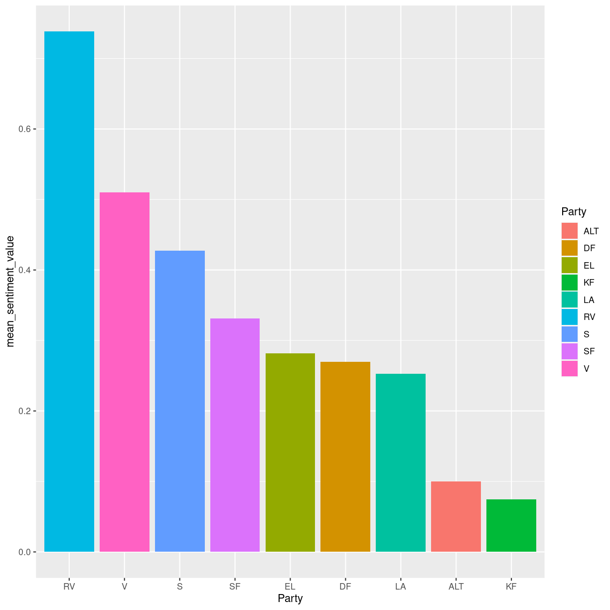
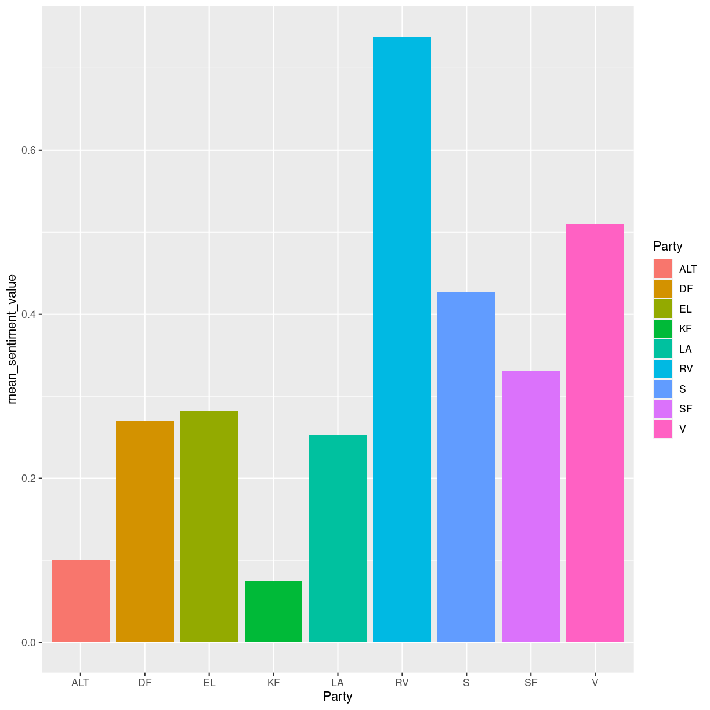

---
# Please do not edit this file directly; it is auto generated.
# Instead, please edit 02_Text_mining_with.md in _episodes_rmd/
title: "Episode 2 tidytext, stopwords, and sentiment analysis"
teaching: 0
exercises: 0
questions:
- "How do we prepare text for analysis and measure the sentiment of the text?"
objectives:
- "First learning objective. (FIXME)"
keypoints:
- "First key point. Brief Answer to questions. (FIXME)"
---

## R Markdown
## Loading our libraries and reading our data
Let us now load our libraries

~~~
library(tidyverse)
library(tidytext)
library(tm)
~~~
{: .language-r}

## Understanding our data

We have now successfully loaded in our dataset. Before we start preparing it for analysis, let us inspect the columns to see what the dataset contains

~~~
head(kina)
~~~
{: .language-r}

~~~
# A tibble: 6 × 19
  ID          Date       Start …¹ End ti…²  Time Agend…³ Case …⁴ Case …⁵ Agend…⁶
  <chr>       <date>     <time>   <time>   <dbl> <chr>     <dbl> <chr>   <chr>  
1 2010011214… 2010-01-12 14:37:05 14:37:25    20 2010-0…      61 B       1. beh…
2 2010011214… 2010-01-12 14:37:25 14:47:59   634 2010-0…      61 B       1. beh…
3 2010011214… 2010-01-12 14:47:59 14:48:05     6 2010-0…      61 B       1. beh…
4 2010011214… 2010-01-12 14:48:05 14:49:01    56 2010-0…      61 B       1. beh…
5 2010011214… 2010-01-12 14:49:01 14:49:03     2 2010-0…      61 B       1. beh…
6 2010011214… 2010-01-12 14:49:03 14:49:47    44 2010-0…      61 B       1. beh…
# … with 10 more variables: `Subject 1` <chr>, `Subject 2` <chr>, Name <chr>,
#   Gender <chr>, Party <chr>, Role <chr>, Title <chr>, Birth <date>,
#   Age <dbl>, Text <chr>, and abbreviated variable names ¹​`Start time`,
#   ²​`End time`, ³​`Agenda item`, ⁴​`Case no`, ⁵​`Case type`, ⁶​`Agenda title`
~~~
{: .output}

We see that we have a lot of metadata, including the date of the speech, the start and end time of the speech, the discussed resolutions/law proposals and their classifications into subjects, as well as various personal information about the speaker. The last column is called `Text` and this contains the speech itself

## Introduction to tidytext and tokenization
To analyze the speeches we need to make the text tidy. Tidy text refers to a dataset where each text has been split up into the individual words that make up the speech. [insert visualization of how words in one row are split into multiple rows]

Splitting texts, in our case speeches, into individual words is called tokenization [insert visualization of tokenization of a sentence]

Tokenization of text into individual words is necessary for text mining because it allows us to analyze the text closely and in detail, analyses which can later be visualized to understand the patterns of the text. Tokenization is language independent, as long as the language is written in an alphabet or syllabary that uses spaces between words. When tokenizating our text to make it tidy, the metadata that describe the whole speech are carried over to also describe the individual word. Thus we can split the text into individual words but still keep track of who said that word and when they did.

We use the tidytext library for tokenization

## Stopwords
In all natural language texts, frequent words that carry little meaning by themselves are distributed all across the text [insert visualization of sentence(s) where stopwords are highlighted].

The frequent low-meaning words need to be removed because they do not add anything to our understanding of the texts and are just noise

The tm library contains a list of stopwords for Danish, which we'll make into a tibble. We have to specify that the list of stopwrds that we want to call is the list for the Danish language. We also rename the tibble column that contains the stopwords. Note that stopword lists are also available for most major European languages

~~~
stopwords_dansk <- as_tibble(stopwords(kind = "danish"))
stopwords_dansk <- stopwords_dansk %>% 
  rename(word = value)
~~~
{: .language-r}

## Sentiment analysis
Sentiment analysis is a method for measuring the sentiment of a text. To do this, it is necessary to have a list of words that have been assigned to a certain sentiment. This can be a simple assignation of words into positive and negative, it can be an assignation to one among a multitude of categories, and the word can have a value on a scale. In this course we will use the AFINN index for Danish, which assigns approximately 3500 words on a scale from +5 to -5. This will enable us to compare the overall sentiment of the various speeches. As a side note, AFINN index is also available in English. 

We need to download the AFINN Index from GitHub

~~~
download.file("https://raw.githubusercontent.com/swillerhansen/R-textmining/main/data/AFINN%20dansk.txt", "data/AFINN_dansk.txt", mode = "wb")
~~~
{: .language-r}

Now we read need to read the AFINN Index into a tibble and rename the columns

~~~
AFINN <- read_delim("data/AFINN_dansk.txt", col_names = FALSE)
AFINN_dansk <- AFINN %>% 
  rename(
    word = X1,
    sentiment_value = X2)
~~~
{: .language-r}

## Bringing it all together: joins
We now have a method for tokenization of text, a stopword list to filter out stopwords, and a sentiment index to measure the sentiment of the parliament speeches. Now we need to bring it all together in the correct order, and we do this by using join-functions. The join functions from the tidyverse library allow tibbles to be joined together according to based on columns and rows that they have in common

There are fundamentally 2 types of joins:
Mutating joins (which add columns)
Filtering joins (which filter away rows)

Mutating joins work by adding new columns to the tibble. We will use left_join, which is the most common of the mutating joins
[insert Venn-diagram of left_join]
The left_join joins all AFINN sentiment values to those rows that contain a word that is in the AFINN Index and adds it as a new column to the tibble. In the new column, the rows that contain words that don't appear in the AFINN Index have NA in their cell

Filtering joins work by filtering away some rows in the tibble. We will use the anti_join, which removes those rows that contain a word that is also in the stopword list
[insert Venn-diagram of anti_join]

For more info on joins see https://r4ds.had.co.nz/relational-data.html

~~~
kina_tidy <- kina %>% 
  unnest_tokens(word, Text) %>% #tidytext tokenization
  anti_join(stopwords_dansk) %>% #stopwords in Danish
  left_join(AFINN_dansk, by = "word") #left join with AFINN Index in Danish
~~~
{: .language-r}

## Analyzing the sentiment of parties
We would like to measure the sentiment of each party when giving speeches on the topic of China

~~~
kina_tidy %>% 
  filter(Role != "formand") %>% 
  group_by(Party) %>% 
  summarize(
    mean_sentiment_value = mean(sentiment_value, na.rm=T)
  ) %>% 
  arrange(desc(mean_sentiment_value)) %>% 
  ggplot(aes(x = fct_rev(fct_reorder(Party, mean_sentiment_value)), y = mean_sentiment_value, fill = Party)) + 
  geom_col() +
  labs(x= "Party") #fct_reorder reorders parties according to value of y. fct_rev sorts the x-values from largest to smallest y-value
~~~
{: .language-r}

## Analyzing the sentiment of rød and blå blok
We would also like to analyze the sentiment of rød and blå blok. To do this, we need to add a column to each row that specifies whether the word comes from a member of a party in rød blok or blå blok. We must therefore first define which parties make up rød and blå blok and put that in a tibble, then bind the two tibbles into one tibble, and then make a left_join to the rows in our tidy text

~~~
roed_blok = tibble(Party = c("ALT", "EL", "SF", "S", "RV"), Blok = c("roed_blok"))
blaa_blok = tibble(Party= c("V", "KF", "LA", "DF"), Blok = c("blaa_blok"))
blok = bind_rows(roed_blok, blaa_blok)
kina_tidy_blokke <- kina_tidy %>% 
  left_join(blok, by = "Party")
~~~
{: .language-r}

Now we would like to do the same analysis of mean sentiment value, this time for each blok. We also want to specify that the column for roed_bloek should be red and the column for blaa_blok should be blue

~~~
kina_tidy_blokke %>% 
  filter(Role != "formand") %>% 
  group_by(Blok) %>% 
  summarize(
    mean_sentiment_value = mean(sentiment_value, na.rm=T)
  ) %>% 
  arrange(desc(mean_sentiment_value)) %>% 
  ggplot(aes(x = fct_rev(fct_reorder(Blok, mean_sentiment_value)), y = mean_sentiment_value, fill = Blok)) + 
  geom_col() +
  scale_fill_manual(values = c("blue", "red")) +
  labs(x= "Blok") #fct_reorder reorders parties according to value of y. fct_rev sorts the x-values from largest to smallest y-value. scale_fill_manual allows us to specify colors for each column. Because of factpr reverse the colors must be specified in reverse order of how the columns appear in the chart
~~~
{: .language-r}

