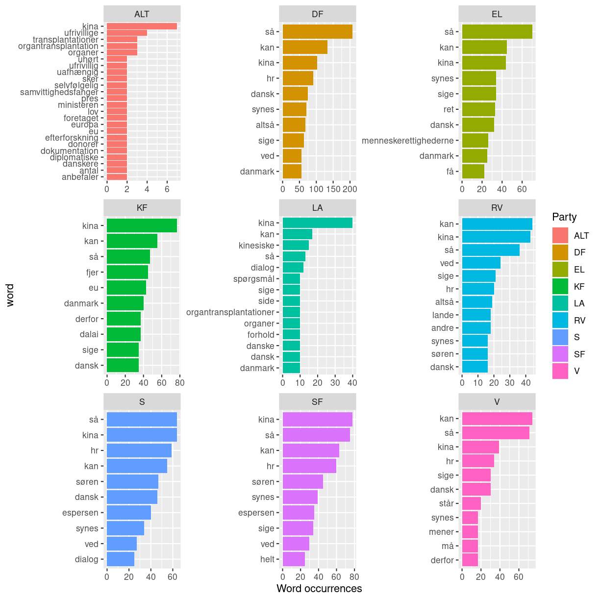

---
# Please do not edit this file directly; it is auto generated.
# Instead, please edit 03TextminingwithREpisode3.md in _episodes_rmd/
title: "Episode 3 word frequency analysis"
teaching: 0
exercises: 0
questions:
- "How can we find the most frequent terms from each party?"
objectives:
- "Learning how to analyze term frequency and visualize it"
keypoints:
- "Custom stopword list may be necessary depending on the context"
---

## R Markdown

~~~
library(tidyverse)
library(tidytext)
library(tm)
~~~
{: .language-r}

## Word frequency
Now that we have seen the average sentiment of the parties, we want to get a deeper understanding of what they talk about when discussing China. We can calculate the most frequent words that each party uses, and then visualize that to get an impression of what they talk about when discussing China.

~~~
kina_tidy_blokke %>% 
  filter(Role != "formand") %>% 
  group_by(Party) %>% 
  count(word, sort = TRUE) %>%
  top_n(10) %>% 
  ungroup() %>% 
  mutate(word = reorder_within(word, n, Party)) %>% 
  ggplot(aes(n, word, fill = Party)) +
  geom_col() + 
  facet_wrap(~Party, scales = "free") +
  scale_y_reordered() +
  labs(x = "Word occurrences")
~~~
{: .language-r}

~~~
Selecting by n
~~~
{: .output}

A  more extensive stopword list for Danish is the ISO stopword list. We will use it know, so lets download it from the repository. Then we save it as an object. Then we make it into a tibble to prepare it for `anti_join` with our dataset

~~~
download.file("https://raw.githubusercontent.com/KUBDatalab/R-textmining/main/data/iso_stopord.txt", "data/iso_stopord.txt", mode = "wb")
iso_stopwords <- read_delim("data/iso_stopord.txt")
~~~
{: .language-r}

~~~
Error: Could not guess the delimiter.

Use `vroom(delim =)` to specify one explicitly.
~~~
{: .error}

~~~
iso_stopwords <- as_tibble(iso_stopwords)
~~~
{: .language-r}

~~~
Error in as_tibble(iso_stopwords): object 'iso_stopwords' not found
~~~
{: .error}

Let us now apply it to the dataset by `anti_join`

~~~
kina_tidy_blokke2 <- kina_tidy_blokke %>% 
  anti_join(iso_stopwords, by = "word")
~~~
{: .language-r}

~~~
Error in is.data.frame(y): object 'iso_stopwords' not found
~~~
{: .error}

Unfortunately for us, most of the most common words are words that act like stopwords, carrying no meaning in themselves. To get around this, we can create our own custom list of stopwords as a tibble, and then `anti_join` it with the dataset, just like we did for the already existing stopword lists.

First we look at the top words to find the stopwords for our custom stopword list. Here I have printed 10, but I have looked at over 70

~~~
kina_tidy_blokke2 %>% 
  filter(Role != "formand") %>% 
  count(word, sort = TRUE) %>% 
  top_n(10) %>% 
  tbl_df %>% 
  print(n=10)
~~~
{: .language-r}

~~~
Error in filter(., Role != "formand"): object 'kina_tidy_blokke2' not found
~~~
{: .error}

Based on this, we select the words that we consider stopwords and make them into a tibble. We also want to include among our stopwords the word Danmark and its genitive case and derivative adjectives, because Denmark of course is frequently named in a Danish parliamentary debate and adds little to our analysis and understanding. Let's also remove the name China, its genitive case and derivative adjectives, because we know that the debate is about China. Let's also remove words that state the title or role of a member of the parliament. Let's also remove the words spørgsmål and møder, as it relates internal questions and meetings among the members of parliament. Upon later examinations some more names have also been added to the custom stopword list

~~~
custom_stopwords <- tibble(word = c("så", "kan", "hr", "sige", "synes", "ved", "altså", "søren", "tror", 
                                    "få", "bare", "derfor", "godt", "andre", "må", "espersen", "mener", "gøre", "helt", "dag", 
                                    "faktisk", "folkeparti", "gerne", "side", "gør", "nogen", "fordi", "hvordan", "tak", "måde", 
                                    "set", "siger", "andet", "sagt", "år", "lige", "står", "tage", "nemlig", "lidt",
                                    "sag", "går", "kommer", "nok", "danmark", "danmarks", "dansk", "danske", "danskt", 
                                    "kina", "kinas", "kinesisk", "kinesiske", "kinesiskt", "kineser", "kineseren", 
                                    "kinesere", "kineserne", "ordfører", "ordføreren", "ordførerens", "ordførere", "ordførerne", 
                                    "spørgsmål", "møder", "holger", "k", "nielsen", "regering", "regeringen", "regeringens", 
                                    "folketinget", "folketingets", "måske", "forslag", "egentlig", "rigtig", "rigtigt", "rigtige", 
                                    "hvert", "bør", "grund", "vigtig", "vigtigt", "vigtige", "ting", "ønsker", "fru", "hr", 
                                    "selvfølgelig", "gange", "præcis", "sagde", "hele", "fald", "enhedslisten", "sidste", 
                                    "forstå", "betyder", "alliances", "fortsat", "venstre", "holde", "præsidium", "baseret"))
~~~
{: .language-r}

We then do an `anti_join`of our custom stopword list to our tidy text

~~~
kina_tidy_blokke3 <- kina_tidy_blokke2 %>% 
  anti_join(custom_stopwords, by = "word")
~~~
{: .language-r}

~~~
Error in anti_join(., custom_stopwords, by = "word"): object 'kina_tidy_blokke2' not found
~~~
{: .error}

Let's now make our plot again

~~~
kina_tidy_blokke3 %>% 
  filter(Role != "formand") %>% 
  group_by(Party) %>% 
  count(word, sort = TRUE) %>%
  top_n(10) %>% 
  ungroup() %>% 
  mutate(word = reorder_within(word, n, Party)) %>% 
  ggplot(aes(n, word, fill = Party)) +
  geom_col() + 
  facet_wrap(~Party, scales = "free") +
  scale_y_reordered() +
  labs(x = "Word occurrences")
~~~
{: .language-r}

~~~
Error in filter(., Role != "formand"): object 'kina_tidy_blokke3' not found
~~~
{: .error}

## tf_idf
We see that many words co-occur among the parties. How can we make a plot of what each party talks about that the others don't?
We can use the tf_idf calculation. Briefly, tf_idf in this case looks at the words that occur among each party, and gives a high value to those that frequently occur in one party but rarely occur among the other parties. This will give us a sense of what each party emphasizes in their speeches about China

First we need to calculate the tf_idf of each word in our tidy text

~~~
kina_tidy_tf_idf <- kina_tidy_blokke3 %>% 
  filter(Role != "formand") %>% 
  count(Party, word, sort = TRUE) %>% 
  bind_tf_idf(word, Party, n) %>% 
  arrange(desc(tf_idf))
~~~
{: .language-r}

~~~
Error in filter(., Role != "formand"): object 'kina_tidy_blokke3' not found
~~~
{: .error}

Now let's make our plot. Most commands in our plot here also appeared in our plot of word frequency, but some have already been taken care of by the previous calculation of tf_idf

~~~
kina_tidy_tf_idf %>% 
  group_by(Party) %>% 
  top_n(10) %>% 
  ungroup() %>% 
  mutate(word = reorder_within(word, tf_idf, Party)) %>% 
  ggplot(aes(tf_idf, word, fill = Party)) +
  geom_col() +
  facet_wrap(~Party, scales = "free") +
  scale_y_reordered() +
  labs(x = "tf_idf")
~~~
{: .language-r}

~~~
Error in group_by(., Party): object 'kina_tidy_tf_idf' not found
~~~
{: .error}

