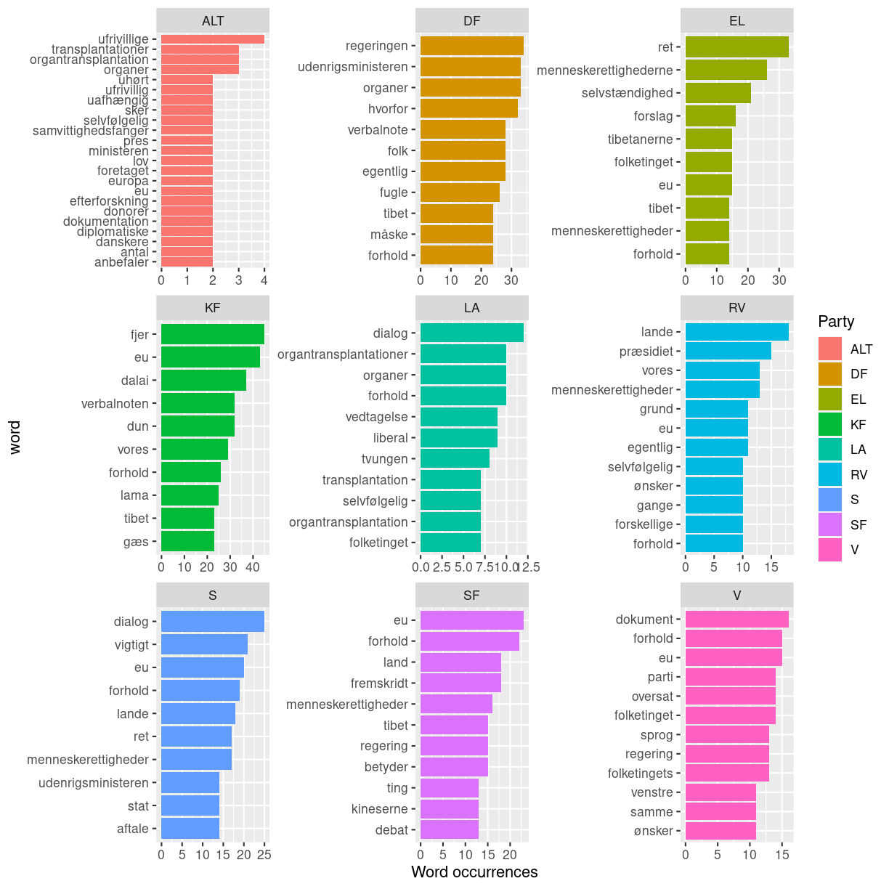
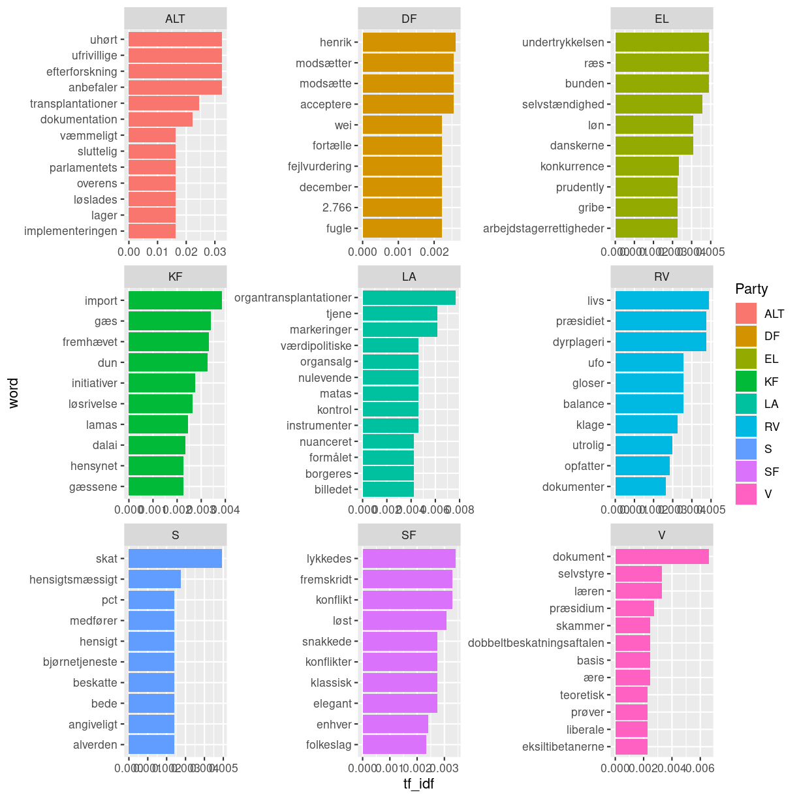

---
# Please do not edit this file directly; it is auto generated.
# Instead, please edit 03TextminingwithREpisode3.md in _episodes_rmd/
title: "Episode 3 word frequency analysis"
teaching: 0
exercises: 0
questions:
- "How can we find the most frequent terms from each party?"
objectives:
- "Learning how to analyze term frequency and visualize it"
keypoints:
- "Custom stopword list may be necessary depending on the context"
---

## R Markdown

~~~
library(tidyverse)
library(tidytext)
library(tm)
~~~
{: .language-r}

## Word frequency
Now that we have seen the average sentiment of the parties, we want to get a deeper understanding of what they talk about when discussing China. We can calculate the most frequent words that each party uses, and then visualize that to get an impression of what they talk about when discussing China.

~~~
kina_tidy_blokke %>% 
  filter(Role != "formand") %>% 
  group_by(Party) %>% 
  count(word, sort = TRUE) %>%
  top_n(10) %>% 
  ungroup() %>% 
  mutate(word = reorder_within(word, n, Party)) %>% 
  ggplot(aes(n, word, fill = Party)) +
  geom_col() + 
  facet_wrap(~Party, scales = "free") +
  scale_y_reordered() +
  labs(x = "Word occurrences")
~~~
{: .language-r}

~~~
Selecting by n
~~~
{: .output}

Unfortunately for us, most of the most common words are words that act like stopwords, carrying no meaning in themselves. To get around this, we can create our own custom list of stopwords as a tibble, and then anti_join it with the dataset, just like we did for the already exisitng stopword list.

First we look at the top 70 words to find the stopwords for our custom stopword list

~~~
kina_tidy_blokke %>% 
  filter(Role != "formand") %>% 
  count(word, sort = TRUE) %>% 
  top_n(70) %>% 
  tbl_df %>% 
  print(n=70)
~~~
{: .language-r}

~~~
Selecting by n
~~~
{: .output}

~~~
# A tibble: 72 × 2
   word                      n
   <chr>                 <int>
 1 så                      584
 2 kina                    495
 3 kan                     486
 4 hr                      318
 5 dansk                   258
 6 sige                    246
 7 synes                   236
 8 ved                     197
 9 danmark                 193
10 altså                   160
11 kinesiske               155
12 eu                      154
13 søren                   153
14 forhold                 140
15 tror                    134
16 få                      133
17 bare                    131
18 derfor                  131
19 godt                    131
20 andre                   130
21 må                      126
22 espersen                125
23 mener                   118
24 gøre                    115
25 helt                    114
26 dag                     108
27 spørgsmål               101
28 vores                   100
29 regeringen               97
30 dialog                   96
31 faktisk                  96
32 danske                   93
33 folkeparti               93
34 tibet                    92
35 gerne                    91
36 side                     89
37 lande                    87
38 selvfølgelig             87
39 gør                      86
40 nogen                    86
41 fordi                    85
42 hvordan                  85
43 menneskerettighederne    85
44 ret                      85
45 tak                      85
46 folketinget              83
47 måde                     83
48 set                      81
49 siger                    81
50 menneskerettigheder      78
51 verbalnoten              78
52 dalai                    77
53 regering                 77
54 andet                    76
55 sagt                     76
56 år                       75
57 udenrigsministeren       75
58 lige                     73
59 står                     73
60 tage                     73
61 debat                    70
62 ønsker                   69
63 fjer                     68
64 nemlig                   68
65 lidt                     67
66 sag                      66
67 går                      65
68 kommer                   65
69 forslag                  64
70 nok                      64
# … with 2 more rows
~~~
{: .output}

Based on this, we select the words that we consider stopwords and make them into a tibble. We also want to include among our stopwords the word Danmark and its genitive case and derivative adjectives, because Denmark of course is frequently named in a Danish parliamentary debate and adds little to our analysis and understanding. Let's also remove the name China, its genitive case and derivative adjectives, because we know that the debate is about China. Let's also remove words that state the title or role of a member of the parliament. Let's also remove the words spørgsmål and møder, as it relates internal questions and meetings among the members of parliament. Upon later examinations some more names have also been added to the custom stopword list

~~~
custom_stopwords <- tibble(word = c("så", "kan", "hr", "sige", "synes", "ved", "altså", "søren", "tror", 
                                    "få", "bare", "derfor", "godt", "andre", "må", "espersen", "mener", "gøre", "helt", "dag", 
                                    "faktisk", "folkeparti", "gerne", "side", "gør", "nogen", "fordi", "hvordan", "tak", "måde", 
                                    "set", "siger", "andet", "sagt", "år", "lige", "står", "tage", "nemlig", "lidt",
                                    "sag", "går", "kommer", "nok", "danmark", "danmarks", "dansk", "danske", "danskt", 
                                    "kina", "kinas", "kinesisk", "kinesiske", "kinesiskt", 
                                    "ordfører", "ordføreren", "ordførerens", "ordførere", "ordførerne", 
                                    "spørgsmål", "møder", "holger", "k", "nielsen"))
~~~
{: .language-r}

We then do an anti_join

~~~
kina_tidy_blokke2 <- kina_tidy_blokke %>% 
  anti_join(custom_stopwords, by = "word")
~~~
{: .language-r}

Let's now make our plot again

~~~
kina_tidy_blokke2 %>% 
  filter(Role != "formand") %>% 
  group_by(Party) %>% 
  count(word, sort = TRUE) %>%
  top_n(10) %>% 
  ungroup() %>% 
  mutate(word = reorder_within(word, n, Party)) %>% 
  ggplot(aes(n, word, fill = Party)) +
  geom_col() + 
  facet_wrap(~Party, scales = "free") +
  scale_y_reordered() +
  labs(x = "Word occurrences")
~~~
{: .language-r}

~~~
Selecting by n
~~~
{: .output}

##tf_idf
We see that many words co-occur among the parties. How can we make a plot of what each party talks about that the others don't?
We can use the tf_idf calculation. Briefly, tf_idf looks at the words that occur among each party, and gives a high value to those that frequently occur in one party but rarely occur among the other parties. This will give us a sense of what each party emphasizes in their speeches about China

First we need to calculate the tf_idf of each word in our tidy text

~~~
kina_tidy_tf_idf <- kina_tidy_blokke2 %>% 
  filter(Role != "formand") %>% 
  count(Party, word, sort = TRUE) %>% 
  bind_tf_idf(word, Party, n) %>% 
  arrange(desc(tf_idf))
~~~
{: .language-r}

Now let's make our plot. Most commands in our plot also appeared in our plot, but some have already been taken care of by the previous calculation of tf_idf

~~~
kina_tidy_tf_idf %>% 
  group_by(Party) %>% 
  top_n(10) %>% 
  ungroup() %>% 
  mutate(word = reorder_within(word, tf_idf, Party)) %>% 
  ggplot(aes(tf_idf, word, fill = Party)) +
  geom_col() +
  facet_wrap(~Party, scales = "free") +
  scale_y_reordered() +
  labs(x = "tf_idf")
~~~
{: .language-r}

~~~
Selecting by tf_idf
~~~
{: .output}

