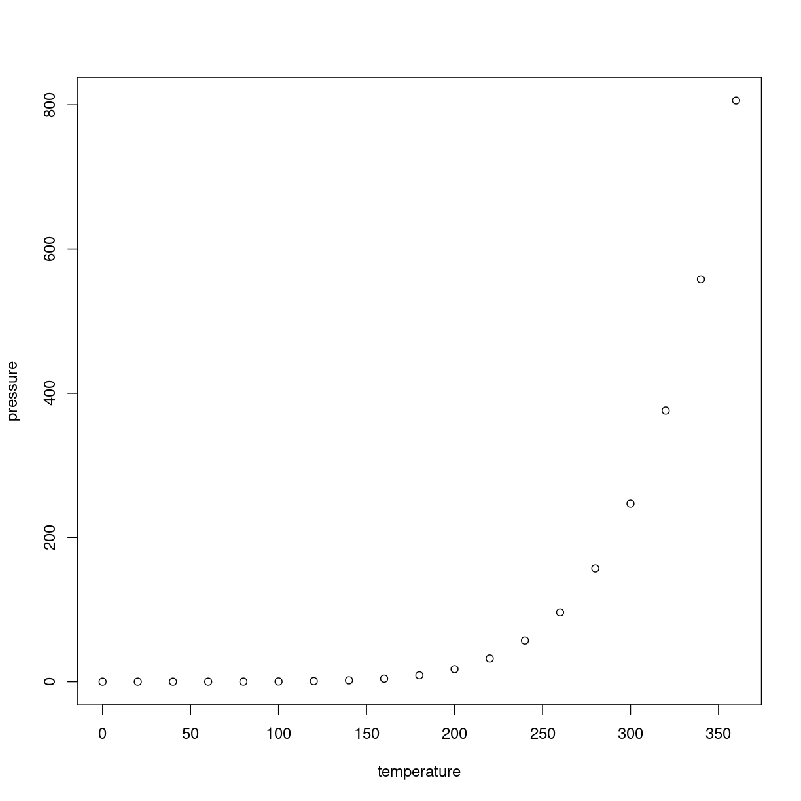

---
# Please do not edit this file directly; it is auto generated.
# Instead, please edit 03TextminingwithREpisode3.md in _episodes_rmd/
title: "Episode 3 word frequency analysis"
teaching: 0
exercises: 0
questions:
- "What is a model?"
objectives:
- "First learning objective. (FIXME)"
keypoints:
- "First key point. Brief Answer to questions. (FIXME)"
---

## R Markdown
## Word frequency
Now that we have seen the average sentiment of the parties, we want to get a deeper understanding of what they talk about when discussing China. We can calculate the most frequent words that each party uses, and then visualize that to get an impression of what they talk about when discussing China.

~~~
kina_tidy_blokke %>% 
  filter(Role != "formand") %>% 
  group_by(Party) %>% 
  count(word, sort = TRUE) %>%
  top_n(10) %>% 
  ungroup() %>% 
  mutate(word = reorder_within(word, n, Party)) %>% 
  ggplot(aes(n, word, fill = Party)) +
  geom_col() + 
  facet_wrap(~Party, scales = "free") +
  scale_y_reordered() +
  labs(x = "Word occurrences")
~~~
{: .language-r}

~~~
Error in kina_tidy_blokke %>% filter(Role != "formand") %>% group_by(Party) %>% : could not find function "%>%"
~~~
{: .error}

Unfortunately for us, most of the most common words are words that act like stopwords, carrying no meaning in themselves. To get around this, we can create our own custom list of stopwords as a tibble, and then anti_join it with the dataset, just like we did for the already exisitng stopword list.

First we look at the top 70 words to find the stopwords for our custom stopword list

~~~
kina_tidy_blokke %>% 
  filter(Role != "formand") %>% 
  count(word, sort = TRUE) %>% 
  top_n(70) %>% 
  tbl_df %>% 
  print(n=70)
~~~
{: .language-r}

~~~
Error in kina_tidy_blokke %>% filter(Role != "formand") %>% count(word, : could not find function "%>%"
~~~
{: .error}

Based on this, we select the words that we consider stopwords and make them into a tibble. We also want to include among our stopwords the word Danmark and its genitive case and derivative adjectives, because Denmark of course is frequently named in a Danish parliamentary debate and adds little to our analysis and understanding. Let's also remove the name China, its genitive case and derivative adjectives, because we know that the debate is about China. Let's also remove words that state the title or role of a member of the parliament. Let's also remove the words spørgsmål and møder, as it relates internal questions and meetings among the members of parliament. Upon later examinations some more names have also been added to the custom stopword list

~~~
custom_stopwords <- tibble(word = c("så", "kan", "hr", "sige", "synes", "ved", "altså", "søren", "tror", 
                                    "få", "bare", "derfor", "godt", "andre", "må", "espersen", "mener", "gøre", "helt", "dag", 
                                    "faktisk", "folkeparti", "gerne", "side", "gør", "nogen", "fordi", "hvordan", "tak", "måde", 
                                    "set", "siger", "andet", "sagt", "år", "lige", "står", "tage", "nemlig", "lidt",
                                    "sag", "går", "kommer", "nok", "danmark", "danmarks", "dansk", "danske", "danskt", 
                                    "kina", "kinas", "kinesisk", "kinesiske", "kinesiskt", 
                                    "ordfører", "ordføreren", "ordførerens", "ordførere", "ordførerne", 
                                    "spørgsmål", "møder", "holger", "k", "nielsen"))
~~~
{: .language-r}

~~~
Error in tibble(word = c("så", "kan", "hr", "sige", "synes", "ved", "altså", : could not find function "tibble"
~~~
{: .error}

We then do an anti_join

~~~
kina_tidy_blokke2 <- kina_tidy_blokke %>% 
  anti_join(custom_stopwords, by = "word")
~~~
{: .language-r}

~~~
Error in kina_tidy_blokke %>% anti_join(custom_stopwords, by = "word"): could not find function "%>%"
~~~
{: .error}

Let's now make our plot again

~~~
kina_tidy_blokke2 %>% 
  filter(Role != "formand") %>% 
  group_by(Party) %>% 
  count(word, sort = TRUE) %>%
  top_n(10) %>% 
  ungroup() %>% 
  mutate(word = reorder_within(word, n, Party)) %>% 
  ggplot(aes(n, word, fill = Party)) +
  geom_col() + 
  facet_wrap(~Party, scales = "free") +
  scale_y_reordered() +
  labs(x = "Word occurrences")
~~~
{: .language-r}

~~~
Error in kina_tidy_blokke2 %>% filter(Role != "formand") %>% group_by(Party) %>% : could not find function "%>%"
~~~
{: .error}

##tf_idf
We see that many words co-occur among the parties. How can we make a plot of what each party talks about that the others don't?
We can use the tf_idf calculation. Briefly, tf_idf looks at the words that occur among each party, and gives a high value to those that frequently occur in one party but rarely occur among the other parties. This will give us a sense of what each party emphasizes in their speeches about China

First we need to calculate the tf_idf of each word in our tidy text

~~~
kina_tidy_tf_idf <- kina_tidy_blokke2 %>% 
  filter(Role != "formand") %>% 
  count(Party, word, sort = TRUE) %>% 
  bind_tf_idf(word, Party, n) %>% 
  arrange(desc(tf_idf))
~~~
{: .language-r}

~~~
Error in kina_tidy_blokke2 %>% filter(Role != "formand") %>% count(Party, : could not find function "%>%"
~~~
{: .error}

Now let's make our plot. Most commands in our plot also appeared in our plot, but some have already been taken care of by the previous calculation of tf_idf

~~~
kina_tidy_tf_idf %>% 
  group_by(Party) %>% 
  top_n(10) %>% 
  ungroup() %>% 
  mutate(word = reorder_within(word, tf_idf, Party)) %>% 
  ggplot(aes(tf_idf, word, fill = Party)) +
  geom_col() +
  facet_wrap(~Party, scales = "free") +
  scale_y_reordered() +
  labs(x = "tf_idf")
~~~
{: .language-r}

~~~
Error in kina_tidy_tf_idf %>% group_by(Party) %>% top_n(10) %>% ungroup() %>% : could not find function "%>%"
~~~
{: .error}

This is an R Markdown document. Markdown is a simple formatting syntax for authoring HTML, PDF, and MS Word documents. For more details on using R Markdown see <http://rmarkdown.rstudio.com>.

When you click the **Knit** button a document will be generated that includes both content as well as the output of any embedded R code chunks within the document. You can embed an R code chunk like this:

~~~
summary(cars)
~~~
{: .language-r}

~~~
     speed           dist       
 Min.   : 4.0   Min.   :  2.00  
 1st Qu.:12.0   1st Qu.: 26.00  
 Median :15.0   Median : 36.00  
 Mean   :15.4   Mean   : 42.98  
 3rd Qu.:19.0   3rd Qu.: 56.00  
 Max.   :25.0   Max.   :120.00  
~~~
{: .output}

## Including Plots

You can also embed plots, for example:

Note that the `echo = FALSE` parameter was added to the code chunk to prevent printing of the R code that generated the plot.

